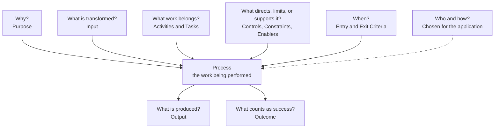
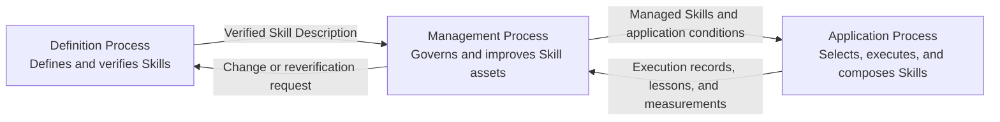

# ALPS — Agent Lifecycle Process Skills

<p align="right">
  <strong>English</strong> | <a href="docs/ja/README.md">Japanese</a>
</p>

<p align="center">
  
</p>

<p align="center">
  <strong>Version 0.2.0</strong><br>
  Initial development
</p>

## What is ALPS?

ALPS is a common language for describing reusable Agent Skills.

In ALPS:

- a **Process** is the work being performed;
- a **Process Description** explains that work; and
- an **Agent Skill** is treated as a Process Description.

A useful description lets a reader understand why the work exists, what success means, what work belongs to it, what enters and leaves it, and what conditions apply. It does not require one particular performer or implementation method.

## Agent Plugin Package

This repository is an [Agent Plugins](https://agent-plugins.org/) v1 package. The root [`plugin.json`](plugin.json) identifies the package, and the three portable Agent Skills are immediate children of [`skills/`](skills/). Repository-shared normative assets remain under [`.alps/`](.alps/) and are referenced by the Skills.

The reference Skills use concise identifiers following the `<verb>-alps` convention:

- `define-alps` — defines and verifies reusable Skills;
- `apply-alps` — selects, executes, and composes Skills; and
- `manage-alps` — governs and improves Skill assets and their application.

## Using ALPS

### Install the plugin

With Node.js 18 or later available, install ALPS through the [`plugins` CLI](https://www.npmjs.com/package/plugins):

```console
npx plugins add mashimashica/alps
```

The installer discovers the Agent Plugin package, detects supported agent clients, and asks for confirmation before installation. Restart the affected clients after installation so they reload the Skills.

The package is installed as a unit, including [`.alps/`](.alps/), so the Skills' shared normative references remain resolvable. Copying only `skills/` is not a complete ALPS installation.

### Invoke a reference Skill explicitly

Clients may select a Skill from its discovery description. When a particular ALPS Process is intended, name the Skill identifier directly in the request. This natural-language form does not depend on client-specific slash-command syntax.

```text
Use `define-alps` to design and verify an ALPS-conformant Skill for this recurring incident-review workflow.

Use `apply-alps` to select and compose the Skills for this request, with every Output/Input handoff made explicit.

Use `manage-alps` to assess this Skill from its execution records and propose controlled improvements.
```

### Add repository guidance

For a repository that uses ALPS regularly, add a short policy to [AGENTS.md](https://agents.md/) so later agent sessions apply the same selection and composition rules. The block below is the canonical minimal policy for a consumer repository. ALPS's own [`AGENTS.md`](AGENTS.md) applies the same core policy and adds repository-maintenance instructions.

```md
## ALPS

This repository uses the ALPS Reference Model.

- For each substantive request, use the ALPS Reference Model to select the applicable reference Skills from `define-alps`, `apply-alps`, and `manage-alps`.
- Identify other ALPS-conformant Skills by the `ALPS-conformant.` marker at the end of `description`, then assess their fit from the discovery description.
- Read each selected Skill's complete `SKILL.md` before applying it.
- Use `apply-alps` for existing Skills, `define-alps` for an unmet need or Skill redefinition, and `manage-alps` for adoption, Tailoring, assessment, change, or retirement.
- When combining Skills, make every Output/Input handoff explicit.
```

## Reading a Skill

ALPS separates questions that are often mixed together in ordinary descriptions.

| Plain-language question | ALPS term |
|---|---|
| Why does the work exist? | **Purpose** |
| What condition counts as success? | **Outcome** |
| What is produced? | **Output** |
| What is transformed? | **Input** |
| What work belongs to the Process? | **Activities and Tasks** |
| What directs, limits, or supports the work? | **Controls, Constraints, and Enablers** |
| When can the work begin or be considered complete? | **Entry Criteria and Exit Criteria** |
| Where does the Process apply? | Its **boundary and application context** |
| Who performs it? | A general Process leaves this open. |
| How is it implemented? | A general Process Description does not prescribe this. |

### Example: turning meeting notes into a usable summary

Suppose an Agent Skill processes meeting notes.

- **Purpose** — make the discussion usable after the meeting.
- **Outcome** — decisions, action items, and unresolved questions are identified.
- **Input** — meeting notes, a transcript, or supplied materials.
- **Output** — a structured meeting summary.
- **Activities and Tasks** — identify relevant statements, classify them, and preserve links to the source.
- **Controls and Constraints** — applicable privacy rules, required formats, and declared limits.
- **Enablers** — language capabilities, tools, and the execution environment.

The Output is the summary that is produced. The Outcome is the condition used to judge whether the Process succeeded. They are related, but they are not the same.

The Skill does not require the work to be performed by one particular person, Agent, or tool, and it does not prescribe one implementation method.

## Process Framework

The Process Framework formalizes these distinctions and gives ALPS a reusable vocabulary for intent, work content, transformation, application context, Process relationships, Tailoring, and Assessment.



`Name`, `Purpose`, and `Outcomes` are required in a Process Description. Activities and Tasks describe work content; they are not implementation methods or procedural steps merely because they appear in an order. Inputs are items transformed into Outputs. People, Agents, tools, and execution environments are resources or Enablers rather than Inputs.

ALPS applies this Framework to Skill description, life cycle management, Tailoring, Assessment, and Conformance. The Framework does not prescribe a life cycle, a sequence of phases, or one implementation method.

## ALPS Reference Model

ALPS defines the Skill life cycle through three Processes. They are not fixed phases and may be applied concurrently, iteratively, or recursively as needed. The arrows show representative Output/Input handoffs.

This repository contains the ALPS specification and three Agent Skills that implement these Processes. English is authoritative, with Japanese localizations bundled in each Skill.



Beyond this Reference Model, ALPS specifies rules for Skill Descriptions, Skill Packages, composition and handoffs across multiple Skills, Controls, Constraints, Enablers, Entry/Exit Criteria, Decision Gates, Tailoring, and Conformance.

## Repository Contents

| Resource | English | Japanese |
| --- | --- | --- |
| Process Framework | [process-framework.md](.alps/spec/process-framework.md) | [process-framework.md](.alps/spec/locales/ja/process-framework.md) |
| ALPS Specification | [ALPS-SPEC.md](.alps/spec/ALPS-SPEC.md) | [ALPS-SPEC.md](.alps/spec/locales/ja/ALPS-SPEC.md) |
| `define-alps` — Definition Process | [SKILL.md](skills/define-alps/SKILL.md) | [SKILL.md](skills/define-alps/references/locales/ja/SKILL.md) |
| `apply-alps` — Application Process | [SKILL.md](skills/apply-alps/SKILL.md) | [SKILL.md](skills/apply-alps/references/locales/ja/SKILL.md) |
| `manage-alps` — Management Process | [SKILL.md](skills/manage-alps/SKILL.md) | [SKILL.md](skills/manage-alps/references/locales/ja/SKILL.md) |

## Versioning

ALPS is versioned as a single repository-wide release unit. The current version is **0.2.0**, and it remains in initial development. The exact contents of a release are identified by its Git tag and commit. See [CHANGELOG.md](CHANGELOG.md) for release history and [Versioning](docs/versioning.md) for compatibility and release rules.

## License and Reuse

Except for identified third-party material, the repository is licensed under the [Apache License, Version 2.0](LICENSE). The license covers the specification, documentation, Skill Packages, scripts, and the project-created icon. See [NOTICE](NOTICE) for attribution and material excluded from the repository license.

## Contributing

Contributions are accepted under the repository license and the [Developer Certificate of Origin 1.1](DCO). Every contributed commit requires a `Signed-off-by` trailer. See [CONTRIBUTING.md](CONTRIBUTING.md) before submitting a change.
