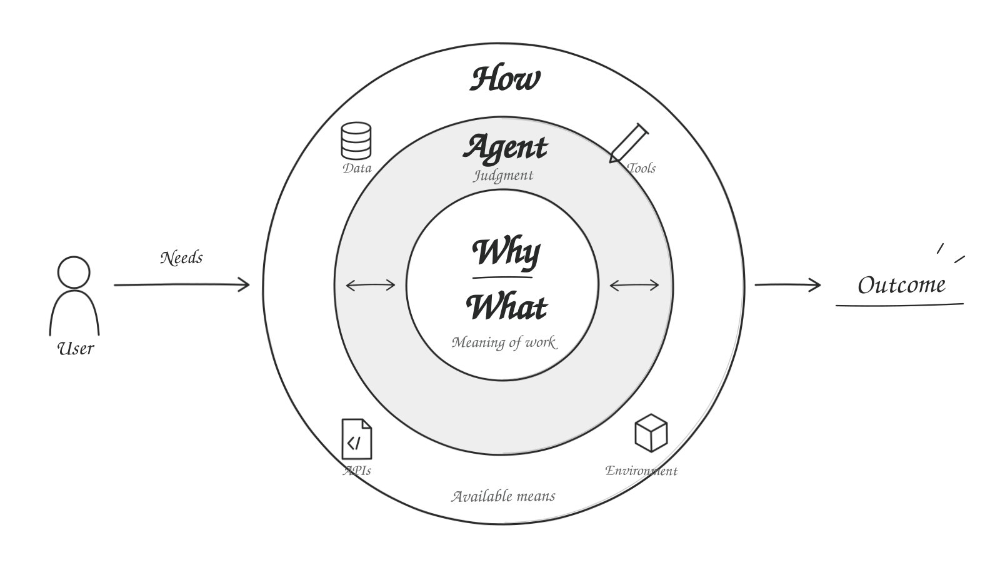

# ALPS — Agent Lifecycle Process Skills

[日本語](docs/locales/ja/README.md)

<p align="center">
  
</p>

ALPS helps you clarify the meaning of work and design the agent work system that realizes it. Describe why the work is done, what observable conditions count as success, and which boundaries and details are necessary. Where needed, design the agents, tools, information resources, and environment that can perform it effectively.

Use it to clarify a one-off assignment, improve an existing Skill, or describe work shared across people and Agents. Start with **Name, Purpose, and Outcomes**; add detail when it changes how the work is understood, applied, or evaluated.

## Install

ALPS is an [Agent Plugins](https://agent-plugins.org/) package with Claude, Cursor, and Codex adapters. Install the complete Plugin through a compatible client. The [`plugins` CLI](https://www.npmjs.com/package/plugins) provides:

```console
npx plugins add mashimashica/alps
```

Reload affected clients after installation. Keep both Skills with their reference resources and the bundled `examples/` in the complete Plugin layout, so required links within and between Skills remain accessible. Check that your client exposes `design-process-description` and `design-agent-work-system` and that their reference links open.

## Use the Skills

| Skill | Design and evaluation target |
| --- | --- |
| [design-process-description](skills/design-process-description/SKILL.md) | The meaning, relationships, and applicable conditions of a Process Description. |
| [design-agent-work-system](skills/design-agent-work-system/SKILL.md) | The configuration and interaction of agents, tools, information resources, and execution environments, including implementation and verification within the request. |

Both support creation, revision, and review. Use either when its design basis is sufficient. A work description may include necessary methods and order; system design refers to that shared meaning and can reveal assumptions that need reconsideration. Ask in ordinary language or name the Skill explicitly as your Host requires.

```text
Use design-process-description to describe this one-off task through its purpose, observable success conditions, and necessary boundaries.

Review this Process Description. Identify unclear Outcomes, unnecessary method constraints, missing references, and limits. Return findings without rewriting it.

Use design-agent-work-system to design the capabilities and interfaces for this work. Reuse suitable tools, implement the missing processing, and verify the configuration on representative cases.

Review this agent work system. Assess the allocation of judgment and processing, information supply, tool interfaces, and evidence of effectiveness. Return findings without changing it.
```

The [minimal template](skills/design-process-description/references/SKILL-template.md) starts with ordinary Agent Skill frontmatter and the three required Process elements. The [examples](skills/design-process-description/references/examples.md) cover minimal and one-off work, work without a fixed artifact, necessary approvals and order, shared information, views, missing references, and Outputs that fail to establish an Outcome.

The [working example](examples/README.md) shows both design responsibilities on one service-assessment Skill. Its script validates measurements and calculates comparisons; the agent assesses the context and interprets the evidence. [System design examples](skills/design-agent-work-system/references/examples.md) also cover existing tools, state-changing operations, and adaptation to changed capabilities.

## Design philosophy

When an AI agent is given a job, not everything should be left to the model. Some parts of the work are established processing; others depend on context and require interpretation, selection, or composition.

ALPS connects two lineages. The [Process Framework](skills/design-process-description/references/process-framework.md) follows process-description practice from systems and software engineering: the meaning of work—its purpose, observable outcomes, necessary work, and applicable conditions—can be described independently of a particular implementation. A Unix-inspired view of agentic systems addresses the other side: expose established processing through clear tools and compose those capabilities as needed. Karun Japhet describes this as [“the agent is the shell”](https://www.sahaj.ai/the-unix-philosophy-for-agentic-coding/). Anthropic similarly distinguishes [code-driven workflows from model-directed agents](https://www.anthropic.com/engineering/building-effective-agents) and recommends [tools that encapsulate stable operations](https://www.anthropic.com/engineering/writing-tools-for-agents).

<p align="center">
  
</p>

In this picture, **Why / What** is the meaning of the work, **How** is the available means, and the **Agent** is responsible for the judgment between them. It interprets the situation, selects and composes capabilities, adapts the method, and can devise new means when existing ones are insufficient. Established calculations, transformations, checks, and stable sequences should be handled by suitable implementations that can perform them reliably.

The diagram is intentionally schematic. A Process Description can include Activities, Tasks, methods, or ordering where they are necessary. The separation is not “What only” versus “How only”; it is between the work being described and the configuration used to realize it.

> **Describe the meaning of work independently of its implementation, make the available means explicit, and leave the judgment between them to the agent.**

ALPS supports this through two complementary Skills: `design-process-description` clarifies the work, while `design-agent-work-system` designs the configuration that realizes it. They are not mandatory sequential phases; either can be used when its design basis is sufficient, and discoveries in one can lead to reconsideration of the other.

ALPS supplies descriptions, design principles, and design support. Your environment supplies execution, storage, approval, and version management.

## Resources

| Resource | English | Japanese |
| --- | --- | --- |
| Meaning of Process Descriptions | [Process Framework](skills/design-process-description/references/process-framework.md) | [プロセスフレームワーク](skills/design-process-description/references/locales/ja/process-framework.md) |
| Work-system design | [Design principles](skills/design-agent-work-system/references/agent-work-system-design.md) | [エージェント作業システムの設計原則](skills/design-agent-work-system/references/locales/ja/agent-work-system-design.md) |
| Process Description Design | [Skill](skills/design-process-description/SKILL.md) | [Skill](skills/design-process-description/references/locales/ja/SKILL.md) |
| Agent Work System Design | [Skill](skills/design-agent-work-system/SKILL.md) | [Skill](skills/design-agent-work-system/references/locales/ja/SKILL.md) |
| Contribution and repository work | [CONTRIBUTING](CONTRIBUTING.md), [AGENTS](AGENTS.md) | [CONTRIBUTING](docs/locales/ja/CONTRIBUTING.md), [AGENTS](docs/locales/ja/AGENTS.md) |
| Version policy and release notes | [Versioning](docs/versioning.md), [0.7.0](docs/releases/0.7.0.md) | [版管理](docs/locales/ja/versioning.md), [0.7.0](docs/locales/ja/releases/0.7.0.md) |

## Version and license

The repository is versioned as one unit. See the version policy and release notes linked above for release scope and compatibility information.

Except for identified third-party material, this repository is licensed under the [Apache License 2.0](LICENSE). See also [NOTICE](NOTICE).
