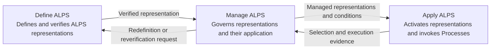

# ALPS — Agent Lifecycle Process Skills

<p align="right">
  <strong>English</strong> | <a href="docs/locales/ja/README.md">Japanese</a>
</p>

<p align="center">
  
</p>

<p align="center">
  <strong>Version 0.3.0</strong><br>
  Initial development
</p>

## What is ALPS?

ALPS is a common language for describing and using reusable Process knowledge through Agent Skills.

The starting point is a Process Description:

- a **Process** is the work being performed;
- a **Process Description** explains that work; and
- by default, an **Agent Skill** represents a Process through an authoritative Process Description.

ALPS also lets Agent Skills represent a **Process Model**, which organizes related Processes and their relationships; a **Process Reference Model**, which defines Processes by Name, Purpose, and Outcomes and relates them explicitly; or a **Process View**, which organizes Activities and Tasks across Processes around a particular concern or Purpose and explains how they are applied. A Process View can reference Activities and Tasks from existing Processes or describe Activities and Tasks within the View. Referenced source elements retain their provenance and Traceability, and View-local descriptions do not by themselves change a source Process. Representing any of these constructs as an Agent Skill does not turn it into a Process. Loading a Model or View is activation; execution begins only when an Agent Skill representing a Process is invoked.

A useful Process Description lets a reader understand why the work exists, what success means, what work belongs to it, what enters and leaves it, and what conditions apply. It does not require one particular performer or implementation method.

## Using ALPS

### Install the plugin

ALPS is distributed as an [Agent Plugins](https://agent-plugins.org/) v1 package. With Node.js 18 or later available, install it through the [`plugins` CLI](https://www.npmjs.com/package/plugins):

```console
npx plugins add mashimashica/alps
```

Restart affected clients after installation so they reload the Agent Skills.

### Start from the ALPS Reference Model

`alps-reference-model` represents the ALPS Process Reference Model. Activate it when you need to select or relate the ALPS reference Processes. Activation loads the model; it does not itself invoke a Process.

| Agent Skill | ALPS representation | Use it when |
| --- | --- | --- |
| `alps-reference-model` | Process Reference Model | The ALPS reference Processes and their relationships must guide selection, assessment, or improvement. |
| `define-alps` | Process | An ALPS representation must be created, redefined, or verified. |
| `apply-alps` | Process | Existing representations must guide Process selection, Invocation, composition, or handoffs. |
| `manage-alps` | Process | Representations must be adopted, tailored, assessed, changed, improved, or retired. |

A Process Model or Process View supplied by another plugin can be activated in the same way. `apply-alps` resolves the Processes referenced by an active Model or View and invokes only Agent Skills that represent Processes.

### Invoke the reference Processes explicitly

```text
Activate `alps-reference-model` and use it to decide which ALPS reference Processes apply.

Use `define-alps` to define and verify an ALPS Process View for this cross-cutting concern.

Use `apply-alps` to activate the applicable Model or View, resolve the required Processes, and make every Output/Input handoff explicit.

Use `manage-alps` to assess these representations and execution records and propose controlled improvements.
```

### Add repository guidance

For a repository that uses ALPS regularly, add a short policy to [AGENTS.md](https://agents.md/). A minimal policy is:

```md
## ALPS

This repository uses ALPS.

- Activate `alps-reference-model` when the ALPS Reference Model is needed for Process selection or assessment.
- Treat Agent Skills as Process representations by default. When `metadata.alps.kind` declares `process-model`, `process-reference-model`, or `process-view`, load that representation without treating activation as Process Invocation.
- Read the complete `SKILL.md` for every selected representation.
- Use `define-alps` to define or verify ALPS representations, `apply-alps` to resolve and invoke Processes, and `manage-alps` for adoption, Tailoring, assessment, change, or retirement.
- For a Process View, preserve provenance and Traceability for referenced source elements and keep View-local descriptions distinct from changes to source Processes.
- When combining Processes, make required Output/Input handoffs explicit.
```

## ALPS Reference Model

ALPS defines its own lifecycle through three Processes. They are not fixed phases and may be applied concurrently, iteratively, or recursively.



The authoritative Process Reference Model is itself packaged as [`skills/alps-reference-model/SKILL.md`](skills/alps-reference-model/SKILL.md). It repeats the Name, Purpose, and Outcomes of the three reference Processes and is mechanically checkable against their authoritative Process Descriptions.

## Representation kinds

An Agent Skill represents a Process by default. Non-Process representations declare their kind in `SKILL.md` metadata:

```yaml
metadata:
  alps.kind: process-model
```

Supported explicit kinds are:

- `process-model`
- `process-reference-model`
- `process-view`

A Process is the only representation kind directly associated with Process Invocation. Process Models, Process Reference Models, and Process Views provide structure, selection context, or a cross-cutting view over Processes.

## Reading a Process Skill

ALPS separates questions that are often mixed together in ordinary descriptions.

| Plain-language question | ALPS term |
|---|---|
| Why does the work exist? | **Purpose** |
| What condition counts as success? | **Outcome** |
| What is produced? | **Output** |
| What is transformed? | **Input** |
| What work belongs to the Process? | **Activities and Tasks** |
| What directs, limits, or supports it? | **Controls, Constraints, and Enablers** |
| When can the work begin or be considered complete? | **Entry Criteria and Exit Criteria** |
| Where does the Process apply? | Its **boundary and application context** |
| Who performs it? | A general Process leaves this open. |
| How is it implemented? | A general Process Description does not prescribe this. |

## Process Framework

The [Process Framework](spec/process-framework.md) defines the reusable vocabulary and semantics used by ALPS. `Name`, `Purpose`, and `Outcomes` are required in a Process Description. Activities and Tasks describe work content rather than implementation steps. Inputs are transformed into Outputs. People, Agents, tools, and execution environments are resources or Enablers rather than Inputs.

The Framework also defines Process Model, Process Reference Model, and Process View. ALPS preserves those meanings when the constructs are represented through Agent Skills.

## Repository Contents

| Resource | English | Japanese |
| --- | --- | --- |
| Process Framework | [process-framework.md](spec/process-framework.md) | [process-framework.md](spec/locales/ja/process-framework.md) |
| ALPS Specification | [ALPS-SPEC.md](spec/ALPS-SPEC.md) | [ALPS-SPEC.md](spec/locales/ja/ALPS-SPEC.md) |
| `alps-reference-model` — Process Reference Model | [SKILL.md](skills/alps-reference-model/SKILL.md) | [SKILL.md](skills/alps-reference-model/references/locales/ja/SKILL.md) |
| `define-alps` — Define ALPS Process | [SKILL.md](skills/define-alps/SKILL.md) | [SKILL.md](skills/define-alps/references/locales/ja/SKILL.md) |
| `apply-alps` — Apply ALPS Process | [SKILL.md](skills/apply-alps/SKILL.md) | [SKILL.md](skills/apply-alps/references/locales/ja/SKILL.md) |
| `manage-alps` — Manage ALPS Process | [SKILL.md](skills/manage-alps/SKILL.md) | [SKILL.md](skills/manage-alps/references/locales/ja/SKILL.md) |

## Validation

The [`alps-markdown/v1`](spec/alps-markdown.md) Environment Binding defines the bounded Markdown/frontmatter representation used by the repository. Its profile checker, `.agents/skills/review-alps/scripts/validate_alps_markdown.py`, is an Application Enabler of the repository-development `review-alps` Process. It dispatches checks by representation kind. For a Process Reference Model, it resolves referenced Process Skills and compares Name, Purpose, and Outcomes with the authoritative Process Descriptions. External package references can be mapped explicitly with `--package-root`.

Mechanical profile checks support review; they do not by themselves establish ALPS Conformance, Outcome achievement, or Process execution conformance.

## Versioning

ALPS versions the repository as one release unit. The current version is **0.3.0** and remains in initial development. Git tags and the commits they identify define exact release contents. See [CHANGELOG.md](CHANGELOG.md) and [Versioning](docs/versioning.md).

## License and Reuse

Except for identified third-party material, this repository is licensed under the [Apache License 2.0](LICENSE). See also [NOTICE](NOTICE).
