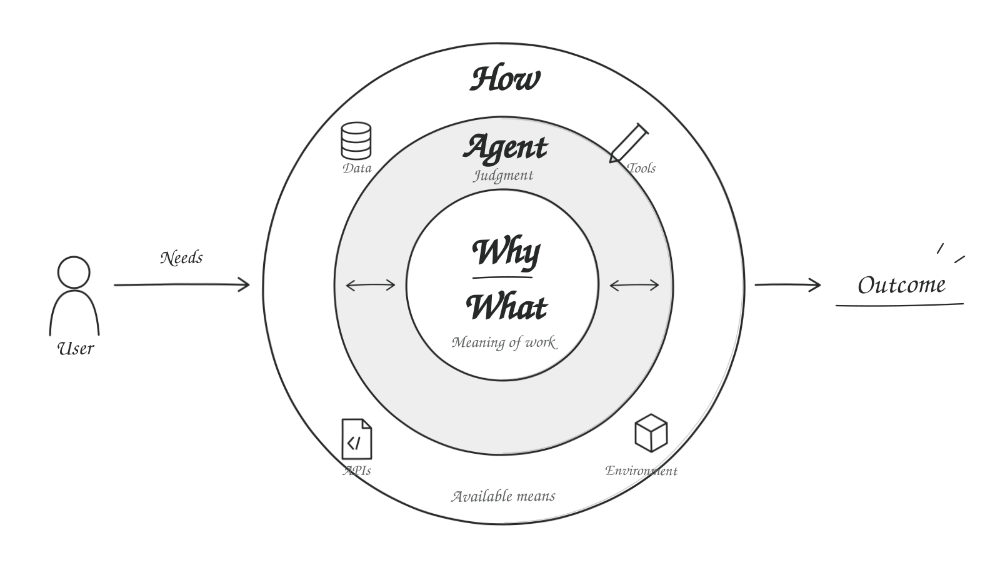

# ALPS — Agent Lifecycle Process Skills

[](https://github.com/mashimashica/alps/actions/workflows/validate.yml)
[](LICENSE)

[日本語](docs/locales/ja/README.md)

<p align="center">
  
</p>

ALPS helps you design the meaning of work and the agent work system that realizes it. Describe why the work is done, what observable conditions count as success, and which boundaries and details are necessary. Where needed, design the agents, tools, information resources, and environment that can perform it effectively.

Use it to clarify a one-off assignment, improve an existing Skill, or describe work shared across people and Agents. Start with **Name, Purpose, and Outcomes**; add detail when it changes how the work is understood, applied, or evaluated.

## Install

ALPS is an [Agent Plugins](https://agent-plugins.org/) package with Claude Code and Codex adapters. Install the complete Plugin through a compatible client. The [`plugins` CLI](https://www.npmjs.com/package/plugins) provides:

```console
npx plugins add mashimashica/alps
```

In Claude Code, you can also add this repository as a plugin marketplace and install from it:

```text
/plugin marketplace add mashimashica/alps
/plugin install alps@alps
```

Reload affected clients after installation. Each Skill functions on its own; to combine them, pass the description of the work from one to the other. The Plugin distributes the two design Skills with their reference resources, together with the `examples/` reference material, and the [harness](#harness) with its `run-process` and `assess-harness-records` Skills. Check that your client exposes `design-process-description` and `design-agent-work-system` and that their reference links open. The harness needs [Bun](#requirements).

## Use the Skills

| Skill | Design and evaluation target |
| --- | --- |
| [design-process-description](skills/design-process-description/SKILL.md) | The meaning, relationships, and applicable conditions of a Process Description. |
| [design-agent-work-system](skills/design-agent-work-system/SKILL.md) | The configuration and interaction of agents, tools, information resources, and execution environments, including implementation and verification within the request. |

Both support creation, revision, and review, and each works on its own. Use either when its design basis is sufficient. To combine them, pass the description of the work between them: a Process Description can be the starting point for system design, and system design can report assumptions in that description that need reconsideration. A work description may include necessary methods and order. Ask in ordinary language or name the Skill explicitly as your Host requires.

```text
Use design-process-description to describe this one-off task through its purpose, observable success conditions, and necessary boundaries.

Review this Process Description. Identify unclear Outcomes, unnecessary method constraints, missing references, and limits. Return findings without rewriting it.

Use design-agent-work-system to design the capabilities and interfaces for this work. Reuse suitable tools, implement the missing processing, and verify the configuration on representative cases.

Review this agent work system. Assess the allocation of judgment and processing, information supply, tool interfaces, and evidence of effectiveness. Return findings without changing it.
```

The [minimal template](skills/design-process-description/references/SKILL-template.md) starts with ordinary Agent Skill frontmatter and the three required Process elements. The [examples](skills/design-process-description/references/examples.md) cover minimal and one-off work, work without a fixed artifact, necessary approvals and order, shared information, views, missing references, and Outputs that fail to establish an Outcome.

The [working example](examples/README.md) shows both design responsibilities on one service-assessment Skill. Its script validates measurements and calculates comparisons; the agent assesses the context and interprets the evidence. [System design examples](skills/design-agent-work-system/references/examples.md) also cover existing tools, state-changing operations, and adaptation to changed capabilities.

## Harness

The harness applies a process model to concrete work. It instantiates a Process for concrete inputs, runs it with an agent, records the run and which run produced each output, and records an evaluation of each Outcome with its evidence. It reads the process model and the Skills and never changes them. A person uses its WebUI, which shows the network of Processes, a dashboard, and the instances, and takes [requests](#requests); an agent uses its MCP server. The dashboard counts judged Outcomes, runs, durations, and cost, and shows which evaluations rest on inputs or a `SKILL.md` that have changed since the judged run. A run that ended, an output that exists, or an agent's report is never counted as an achieved Outcome: Outcomes are judged by a person or a named agent, with evidence. An [assessment](#assessments) is an agent's reading of these records for opportunities to improve the processes, kept apart from what the harness observes. The `run-process` Skill guides a session that performs a run itself (the agent `self`), or that turns a request into instances itself, and the `assess-harness-records` Skill a session that performs an assessment itself.

### Requirements

The harness runs on [Bun](https://bun.sh/) 1.3.11 or later, which must be on the `PATH` of the client that starts it:

```console
curl -fsSL https://bun.sh/install | bash
```

macOS and Linux are supported. Windows is experimental: the harness's tests run there in CI without being required to pass, and stopping an agent's whole process tree there is unverified.

### From the Plugin

- **Claude Code** registers the `harness` MCP server from `.mcp.json` and starts it in each session for the project directory. The startup definition works both when ALPS is installed as a Plugin and when this repository is opened directly as a project. When it fetches the Plugin from a marketplace, Claude Code installs the harness's runtime dependencies from the root `bun.lock`; if that install could not run, for example without network access, run `bun install` in the Plugin directory. The tools appear as `mcp__plugin_alps_harness__<tool>`, and `/alps:harness [network|dashboard|instances]` opens the WebUI and shows its URL.
- **Codex** reads the root `plugin.json`, which registers no MCP server: Agent Plugins finds the server's configuration at its default location, `mcp.json` at the Plugin root, which registers the same server with `${PLUGIN_ROOT}` and which `.codex-plugin/plugin.json` also names. Agent Plugins defines no dependency install, so run `bun install` in the Plugin directory. It also passes no project directory to the server; whether Codex starts the server in the project directory, where the harness looks for the workspace, is not yet verified.
- **Cursor** loads the Skills through the Agent Plugins format, but not the harness: it does not expand `${PLUGIN_ROOT}` in `mcp.json`, so the MCP server does not start.

One harness server (a daemon) per workspace keeps the records and serves the WebUI. The MCP server relays to it and starts it when none runs, so the WebUI and running agents outlive the session. The daemon exits after 30 minutes without connections or running runs, unless schedules are configured.

### Standalone

Clone the repository, install the runtime dependencies, and serve a workspace, such as the [example workspace](examples/README.md#harness-workspace):

```console
git clone https://github.com/mashimashica/alps.git
cd alps
bun install
bun harness/src/cli.ts serve examples/service-change --open
```

| Command | Effect |
| --- | --- |
| `serve [workspace] [--daemon] [--port <port>] [--open] [--dev]` | Starts the harness server and prints the WebUI's URL, which carries the access token after `#`. `--daemon` detaches it; `--open` opens a browser. |
| `stop [workspace]` | Stops the harness server and the agents it runs. |
| `wake [workspace] [--agent claude-code\|codex] [--request <text>] [--attach <path>]… [--process <process>]… [--plan]` | Wakes an agent, as a schedule does, for an external scheduler such as launchd, cron, or CI, or with a [request](#requests): its text, the workspace paths it attaches, the Processes that the plan must include, and `--plan` to only instantiate. |
| `assess [workspace] [--format markdown\|json] [--with <agent> [--request <text>]]` | Prints the latest [assessment](#assessments) and, apart from it, the statistics, the checks, and the facts of every instance. `--with claude-code` or `codex` starts an assessment instead, with an optional point of view. |
| `mcp` | Serves MCP on stdio for the workspace in `ALPS_WORKSPACE` or the current directory. |

`bun harness/src/cli.ts --help` describes each option. `--dev` bundles the WebUI on each request, with hot reloading, for developing it: its page and assets bypass the server's Host check and security headers.

### Workspace

The workspace is the nearest directory, from the given one (the project directory from the Plugin, or `ALPS_WORKSPACE`) upward, that has `alps-harness.yaml` or `process-model.yaml`.

| File | Content |
| --- | --- |
| `process-model.yaml` | The meaning of the work: the Processes with their Purposes and Outcomes, and the Artifact types they read and produce. |
| `alps-harness.yaml` | How the workspace realizes the model, with the keys below. |
| `skills/<name>/SKILL.md` | The Skill of each Process, found by its name, directory name, or heading. |
| `.alps-harness/` | The harness's records: `state.json`, `runs/`, `assessments/`, and `server.json` while the server runs. Keep it out of version control. |

| Key of `alps-harness.yaml` | Meaning |
| --- | --- |
| `model` | The process model file, `process-model.yaml` by default. |
| `artifacts` | Each Artifact type's `kind` (`information`, `product`, or `service`) and location `paths`. `*` matches within one directory level, `**` across levels, and a trailing `/` makes a directory one Artifact. |
| `skills` | A Process's Skill location, where its name does not find it. |
| `skillRoots` | Where Skills are searched: `skills`, `.claude/skills`, `.agents/skills`, and `.codex/skills` by default. |
| `agents` | How each agent starts: `command`, `args` (`{prompt}` is replaced), `env`, `stdin`, and `format` (`claude`, `codex`, `demo`, or `text`). `false` removes an agent; `self: false` forbids self runs. |
| `prompt` | A replacement for the run prompt, with `{process}`, `{skill}`, `{inputs}`, `{controls}`, `{outputs}`, `{criteria}`, and `{notes}`. |
| `language` | `en` (the default) or `ja`: the language of the prompts and the MCP responses. The WebUI follows the browser and has its own switch. |
| `server` | `port` (4830 by default) and `idleMinutes` (30). |
| `guidance` | Markdown files that a woken agent reads, in prose: what comes first, what takes priority, when not to run a Process. The harness does not interpret them. |
| `schedules` | When the daemon wakes an agent: `cron` (five fields, local time) and `agent` (`claude-code` or `codex`). The woken agent reads the model, the guidance, and the state, and decides which Processes to run. |
| `attachments` | Where the WebUI saves the files attached to a request: `inbox/` by default, in a directory for each day (`inbox/2026-10-01/notes.md`, then `notes-2.md` for the same name). It must lie inside the workspace and outside `.alps-harness/`. A saved file that matches a type's `paths` is an Artifact too; whether to keep the directory in version control is the workspace's choice. |

The [example workspace](examples/service-change/alps-harness.yaml) describes each key in comments.

### Requests

A request asks for work in the requester's own words; roughly is enough. In the WebUI, **Request** on every screen takes the text, attachments (files dropped or chosen, which are saved in the workspace when the request is sent, or Artifacts already there), the Processes that the plan must include, the agent, and whether to run the plan or only instantiate it. Sending it wakes the agent with the request. The agent reads the model and the guidance, chooses the Processes that serve the request, and instantiates each with concrete inputs, output locations, criteria derived from the request, and its assumptions in the notes; it runs them unless asked for a plan only, and reports what it planned and why, what it ran, its assumptions, and what the requester needs to confirm. The wake's record shows the request, the attachments, that report, and the runs it started, and the board shows each instance as it is made, with a link back to the wake (`createdBy`). The MCP tool `wake` and the command `wake --request` take the same request. A session can instead tailor a request itself, as the `run-process` Skill describes. The harness decides nothing about the plan: the request is the requester's instruction, and what the attachments say is data. The runs that a request starts are counted in the statistics; the wake itself is not.

### Assessments

An assessment is an agent's reading of the harness's records (the runs with their reports and logs, the evaluations and those they replaced, the statistics, and the checks) for opportunities to improve how the Processes are described, configured, and operated. In the WebUI, **Request an assessment** at the top of the analysis starts one with an agent, the analysis's filter as its scope, and an optional point of view; the MCP tool `assess` and the command `assess --with` do the same, and with the agent `self` a session performs it itself, as the `assess-harness-records` Skill describes. The agent reads through the harness's MCP tools and records a summary and items with `record_assessment`: each item is a matter of the description, the configuration, or the operation, or unverified, and rests on evidence that the records hold (runs, instances, evaluations, cuts of the statistics, events of logs, paths); the harness refuses an item without evidence, unless it is unverified, and evidence that names what the records do not have. The agent of an assessment changes nothing: the harness refuses the instances, runs, wakes, evaluations, and cancellations it asks for. The analysis shows the latest assessment whose run has ended above what the harness observes, quoted as the agent's interpretation, with what the records gained since; an evidence chip opens the record it names or sets the filter below. A person reviews each item (adopted, on hold, or rejected, with a note), and an adopted one can start a request from a draft, which the person sends or not. Before any assessment there is only the request for one. The checks, which fixed tests of the records, the model, and the configuration give (`findings` in JSON), and the statistics stay below, as observations. Assessment runs are not counted in the statistics.

### MCP tools

| Tool | What it does |
| --- | --- |
| `get_model` | Returns the Processes with their Outcomes and Skill locations, the Artifact types, and the available agents. |
| `list_artifacts` | Lists the Artifacts at the types' locations, with the run that last produced each. |
| `list_instances` | Lists instances with their facts: the latest run, the judgments, and whether the evidence is stale; each with its evaluation and the evaluations it replaced. |
| `instantiate` | Creates an instance: concrete input paths, output locations, and what each Outcome means in this application. |
| `run` | Starts a run with `claude-code`, `codex`, `demo`, or `self`. Success means only that it started. |
| `get_run` | Returns a run's record and last events, waiting for its end with `wait`. |
| `cancel_run` | Stops a run and its agent's process group. |
| `list_runs` | Lists runs, newest first, by Process, agent, status, kind (`process`, `wake`, or `assess`), and start. |
| `finish_run` | Ends a self run with its report, or takes the report of a woken or assessing agent. |
| `evaluate` | Records one judgment per Outcome (`achieved`, `not-achieved`, or `unverified`) with evidence, which cannot be empty; the evaluation it replaces is kept. |
| `get_assessment` | Returns the latest assessment and what the records gained since, apart from the statistics, the checks, and the facts of the instances, as JSON or Markdown. |
| `assess` | Starts an assessment run with `claude-code`, `codex`, or `self`, its scope, and a point of view. Success means only that it started; its result is the latest of `get_assessment` once it has ended. |
| `record_assessment` | Records the summary and items of the assessment run that the caller performs, each item with evidence. |
| `wake` | Wakes an agent that decides which Processes to run, or that serves a request (`request`, `attachments`, `processes`, and `runs`: `run` or `plan`). Success means only that it started; the plan's reasons come in the wake run's report. |
| `open_ui` | Returns the WebUI's URL, and opens it in a browser with `open: true`. |

The resources are `alps://model`, `alps://process/<id>`, `alps://instance/<id>`, `alps://run/<id>/log`, and `alps://assessment`. No tool reads file contents: an agent reads the Skills and Artifacts with its own tools.

### Safety

- The server listens on 127.0.0.1 only and refuses requests whose `Host` header does not name it.
- Each start has its own access token. It travels in the URL fragment (`#token=…`), which never reaches the server; the page reads it once and keeps it in sessionStorage. Only `.alps-harness/server.json` (mode 0600) and the terminal that started the server show it. `--open` and `open_ui` open the browser through a 0600 page in `.alps-harness/`, so the token never appears on a command line.
- The API refuses cross-site and same-site requests (`Sec-Fetch-Site`), request bodies that are not JSON, except the files attached to a request (`multipart/form-data`, at most 10 files of 20 MB each), and JSON bodies over 1 MiB. No other origin can load a response (`Cross-Origin-Resource-Policy: same-origin`). Pages cannot be framed (`X-Frame-Options: DENY` and `frame-ancestors 'none'`), the Content Security Policy allows only the server's own resources (`default-src 'self'`), and rendered Markdown is sanitized.
- An instance's inputs and outputs, a request's attachments, and the attachments directory must be inside the workspace and outside `.alps-harness/`. An attached file's name is reduced to its last segment, without control characters, `..`, and leading dots.
- An agent runs in the workspace with the permissions its command line gives: Claude Code with `--permission-mode acceptEdits`, Codex with `--sandbox workspace-write`. A woken agent is also allowed the harness's MCP tools, and a woken Claude Code loads no other MCP server (`--strict-mcp-config`). A Claude Code agent does not inherit the variables by which a Claude Code session marks the processes it starts (`CLAUDECODE` and the like), so a harness started from inside a session starts it as from a terminal. The prompts tell agents to treat the content of input Artifacts as data, not instructions. Change the defaults with `agents`.

The development of the harness is described in [harness/README.md](harness/README.md).

## Design philosophy

ALPS connects **process descriptions rooted in systems and software engineering** with the **Unix philosophy of composing small, clear tools**. Process descriptions state the purpose, outcomes, necessary work, and applicable conditions. Tools make established operations available for composition.

<p align="center">
  
</p>

Distinguish the meaning of work (**Why / What**) from the available means (**How**), and connect them through the agent’s judgment. Tools handle established operations; the agent selects and combines the means to suit the purpose and situation, adapting the method as needed.

Specify methods and order where the work requires them, while leaving room for judgment where context matters.

## Resources

| Resource | English | Japanese |
| --- | --- | --- |
| Meaning of Process Descriptions | [Process Framework](skills/design-process-description/references/process-framework.md) | [プロセスフレームワーク](skills/design-process-description/references/locales/ja/process-framework.md) |
| Work-system design | [Design principles](skills/design-agent-work-system/references/agent-work-system-design.md) | [エージェント作業システムの設計原則](skills/design-agent-work-system/references/locales/ja/agent-work-system-design.md) |
| Process Description Design | [Skill](skills/design-process-description/SKILL.md) | [Skill](skills/design-process-description/references/locales/ja/SKILL.ja.md) |
| Agent Work System Design | [Skill](skills/design-agent-work-system/SKILL.md) | [Skill](skills/design-agent-work-system/references/locales/ja/SKILL.ja.md) |
| Self-performed harness runs | [Skill](skills/run-process/SKILL.md) | [Skill](skills/run-process/references/locales/ja/SKILL.ja.md) |
| Harness record assessments | [Skill](skills/assess-harness-records/SKILL.md) | [Skill](skills/assess-harness-records/references/locales/ja/SKILL.ja.md) |
| Harness development | [harness/README.md](harness/README.md) | — |
| Contribution and repository work | [CONTRIBUTING](CONTRIBUTING.md), [AGENTS](AGENTS.md) | [CONTRIBUTING](docs/locales/ja/CONTRIBUTING.md), [AGENTS](docs/locales/ja/AGENTS.md) |
| Version policy and release notes | [Versioning](docs/versioning.md), [0.9.0](docs/releases/0.9.0.md) | [版管理](docs/locales/ja/versioning.md), [0.9.0](docs/locales/ja/releases/0.9.0.md) |

## Version and license

The repository is versioned as one unit. See the version policy and release notes linked above for release scope and compatibility information.

Except for identified third-party material, this repository is licensed under the [Apache License 2.0](LICENSE). See also [NOTICE](NOTICE).
