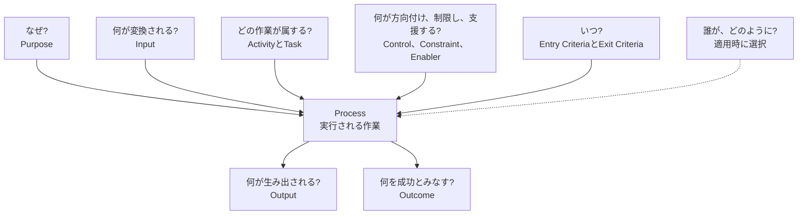
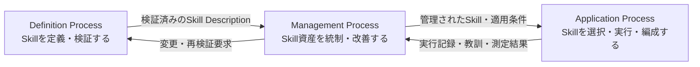

# ALPS — Agent Lifecycle Process Skills

<p align="right">
  <a href="../../README.md">英語</a> | <strong>日本語</strong>
</p>

<p align="center">
  
</p>

<p align="center">
  <strong>Version 0.2.0</strong><br>
  初期開発版
</p>

## ALPSとは

ALPSは、再利用可能なAgent Skillを記述するための共通言語です。

ALPSでは、次のように区別します。

- **Process**は、実行される作業です。
- **Process Description**は、その作業を説明します。
- **Agent Skill**は、Process Descriptionとして扱います。

有用な記述によって、読者は、作業がなぜ存在するか、何を成功とみなすか、どの作業がProcessに属するか、何が入り何が出るか、どの条件が適用されるかを理解できます。特定の実行主体または実装方法を一つに固定する必要はありません。

## Agent Plugin Package

本リポジトリは、[Agent Plugins](https://agent-plugins.org/) v1のPackageです。リポジトリ直下の[`plugin.json`](../../plugin.json)がPackageを識別し、三つの可搬なAgent Skillを[`skills/`](../../skills/)の直下に配置します。リポジトリ共通の規範資産は[`.alps/`](../../.alps/)に保持し、各Skillから参照します。

このPackageは、Claude Code、Cursor、Codex、GitHub Copilot CLIおよびVisual Studio Codeからインストールできます。各クライアントが対応する表示メタデータは、クライアント固有のAdapterに分離しています。Claude Codeは[`.claude-plugin/plugin.json`](../../.claude-plugin/plugin.json)、Cursorは[`.cursor-plugin/plugin.json`](../../.cursor-plugin/plugin.json)、Codexは[`.codex-plugin/plugin.json`](../../.codex-plugin/plugin.json)と各Skillの`agents/openai.yaml`を使用します。rootのManifestは、可搬なPackageの識別情報とComponent発見における唯一のSource of Truthです。

参照Skillの識別子には、`<verb>-alps`の簡潔な命名規則を用います。

- `define-alps` — 再利用可能なSkillを定義・検証する。
- `apply-alps` — Skillを選択・実行・編成する。
- `manage-alps` — Skill資産およびその適用を統制・改善する。

## ALPSを利用する

### Pluginをインストールする

Node.js 18以降が利用できる環境で、[`plugins` CLI](https://www.npmjs.com/package/plugins)からALPSをインストールします。

```console
npx plugins add mashimashica/alps
```

インストーラーはAgent PluginのPackageを検出し、対応するAgentクライアントを判別し、確認後にインストールします。インストール後は、Skillを再読み込みできるよう、対象クライアントを再起動してください。

上記のコマンドでインストールすると、`plugins` CLIは[`.alps/`](../../.alps/)を含むPackage全体を保持するため、各Skillから共通規範文書への参照を解決できます。`skills/`だけをコピーしても、完全なALPSのインストールにはなりません。

### 参照Skillを明示的に呼び出す

クライアントは、発見用の記述からSkillを選択できます。特定のALPS Processを用いる場合は、依頼の中でSkill識別子を直接指定します。この自然言語形式は、クライアント固有のスラッシュコマンド構文に依存しません。

```text
`define-alps`を使って、この反復的なインシデントレビュー作業をALPS準拠のSkillとして設計・検証してください。

`apply-alps`を使って、この依頼に必要なSkillを選択・編成し、すべてのOutput/Inputの授受を明示してください。

`manage-alps`を使って、このSkillを実行記録に基づいて評価し、統制された改善案を提示してください。
```

### AGENTS.mdに利用方針を記載する

ALPSを継続的に利用するリポジトリでは、以後のAgentセッションでも同じ選択・編成規則を適用できるように、[AGENTS.md](https://agents.md/)へ短い方針を追加します。以下は利用側リポジトリ向けの正本となる最小方針です。ALPS自身の[`AGENTS.md`](../../AGENTS.md)も同じ中核方針を適用し、リポジトリ保守の作業規則を追加しています。

```md
## ALPS

本リポジトリではALPS Reference Modelを使用します。

- 実質的な依頼ごとに、ALPS Reference Modelを基準として、`define-alps`、`apply-alps`および`manage-alps`から適用する参照Skillを選択します。
- その他のALPS準拠Skillは、`description`末尾の`ALPS準拠。`表示によって識別し、発見用の記述から依頼への適合性を判断します。
- 選択した各Skillの`SKILL.md`を、適用前に最後まで読みます。
- 既存Skillを適用する作業には`apply-alps`、未充足ニーズまたはSkillの再定義には`define-alps`、採用、Tailoring、評価、変更または廃止には`manage-alps`を用います。
- 複数Skillを組み合わせる場合は、すべてのOutput/Inputの授受を明示します。
```

## Skillの読み方

ALPSは、通常の記述では混ざりやすい問いを分けて扱います。

| 日常語の問い | ALPSの用語 |
|---|---|
| この作業はなぜ存在するか？ | **Purpose** |
| どの状態を成功とみなすか？ | **Outcome** |
| 何が生み出されるか？ | **Output** |
| 何が変換されるか？ | **Input** |
| どの作業がProcessに属するか？ | **ActivityとTask** |
| 何が作業を方向付け、制限し、または支援するか？ | **Control、ConstraintおよびEnabler** |
| いつ作業を開始でき、いつ完了とみなせるか？ | **Entry CriteriaとExit Criteria** |
| Processの範囲はどこまでで、どの状況に適用されるか？ | **境界と適用状況** |
| 誰が実行するか？ | 一般Processは固定しません。 |
| どのように実装するか？ | 一般Process Descriptionは規定しません。 |

### 例：会議記録を利用可能な要約にする

Agent Skillが会議記録を処理する場合を考えます。

- **Purpose** — 会議後も議論を利用できるようにする。
- **Outcome** — 意思決定、実行事項および未解決事項が識別されている。
- **Input** — 会議メモ、書き起こしまたは提供資料。
- **Output** — 構造化された会議要約。
- **ActivityとTask** — 関係する記述を識別し、分類し、出所との対応を維持する。
- **ControlとConstraint** — 適用されるプライバシー規則、必須形式および宣言された制限。
- **Enabler** — 言語能力、ツールおよび実行環境。

Outputは、生み出される要約です。Outcomeは、Processが成功したかを判断するための状態です。両者は関係しますが、同じものではありません。

このSkillは、特定の人、Agentまたはツールによる実行を要求せず、特定の実装方法も規定しません。

## Process Framework

Process Frameworkは、これらの区別を形式化し、意図、作業内容、変換、適用状況、Process間の関係、TailoringおよびAssessmentを扱う再利用可能な語彙をALPSに提供します。



`Name`、`Purpose`および`Outcomes`は、Process Descriptionの必須要素です。ActivityとTaskは作業内容を記述し、記載順だけを理由として、実装方法や手順上の段階として解釈されるものではありません。InputはOutputに変換される項目です。人、Agent、ツールおよび実行環境はInputではなく、資源またはEnablerです。

ALPSは、このFrameworkをSkillの記述、ライフサイクル管理、Tailoring、AssessmentおよびConformanceに適用します。Frameworkは、ライフサイクル、段階の順序または特定の実装方法を規定しません。

## ALPS参照モデル

ALPSは、Skillのライフサイクルを三つのProcessによって定義します。これらは固定された段階ではなく、必要に応じて並行的、反復的または再帰的に適用できます。矢印は代表的なOutputとInputの受け渡しを示します。

このリポジトリは、ALPSの規格文書と、これらのProcessを実装する三つのAgent Skillを提供します。英語版を正本とし、各Skillに日本語ローカライズを収録します。



ALPS規格は、この参照モデルに加えて、Skill Description、Skill Package、複数Skillの組合せと受け渡し、Control、Constraint、Enabler、Entry/Exit Criteria、Decision Gate、TailoringおよびConformanceの規則を定めます。

## 収録内容

| 内容 | 英語 | 日本語 |
| --- | --- | --- |
| Process Framework | [process-framework.md](../../.alps/spec/process-framework.md) | [process-framework.md](../../.alps/spec/locales/ja/process-framework.md) |
| ALPS Specification | [ALPS-SPEC.md](../../.alps/spec/ALPS-SPEC.md) | [ALPS-SPEC.md](../../.alps/spec/locales/ja/ALPS-SPEC.md) |
| `define-alps` — 定義Process | [SKILL.md](../../skills/define-alps/SKILL.md) | [SKILL.md](../../skills/define-alps/references/locales/ja/SKILL.md) |
| `apply-alps` — 適用Process | [SKILL.md](../../skills/apply-alps/SKILL.md) | [SKILL.md](../../skills/apply-alps/references/locales/ja/SKILL.md) |
| `manage-alps` — 管理Process | [SKILL.md](../../skills/manage-alps/SKILL.md) | [SKILL.md](../../skills/manage-alps/references/locales/ja/SKILL.md) |

## バージョン管理

ALPSは、リポジトリ全体を一つのリリース単位としてバージョン管理します。現在のVersionは**0.2.0**であり、初期開発段階にあります。Releaseの正確な内容は、Git TagとCommitによって特定します。[CHANGELOG.md](../../CHANGELOG.md)および[バージョン管理方針](versioning.md)を参照してください。

## ライセンスと再利用

明示した第三者資料を除き、本リポジトリには[Apache License, Version 2.0](../../LICENSE)を適用します。ライセンスの対象は、規格、文書、Skill Package、スクリプトおよび本プロジェクトが作成したアイコン一点です。帰属表示が必要な資料、および本リポジトリのライセンス対象外となる資料については、[NOTICE](../../NOTICE)を参照してください。

## 貢献

貢献は、リポジトリのライセンスおよび[Developer Certificate of Origin 1.1](../../DCO)に基づいて受け入れます。貢献するすべてのコミットには`Signed-off-by`トレーラーが必要です。変更を提出する前に[CONTRIBUTING.md](../../CONTRIBUTING.md)を確認してください。
