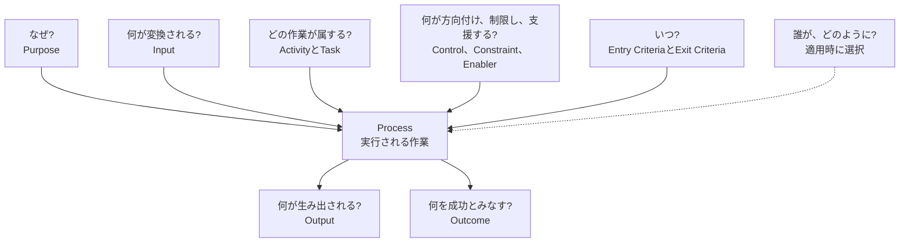
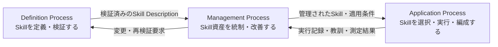

# ALPS — Agent Lifecycle Process Skills

  <a href="../../README.md">英語</a> | <strong>日本語</strong>

  

## ALPSとは

ALPSは、再利用可能なAgent Skillを記述するための共通言語です。

ALPSでは、次のように区別します。

- **Process**は、実行される作業です。
- **Process Description**は、その作業を説明します。
- **Agent Skill**は、Process Descriptionとして扱います。

有用な記述によって、読者は、作業がなぜ存在するか、何を成功とみなすか、どの作業がProcessに属するか、何が入り何が出るか、どの条件が適用されるかを理解できます。特定の実行主体または実装方法を一つに固定する必要はありません。

## Skillの読み方

ALPSは、通常の記述では混ざりやすい問いを分けて扱います。

| 日常語の問い | ALPSの概念 |
|---|---|
| この作業はなぜ存在するか？ | **Purpose** |
| どの状態を成功とみなすか？ | **Outcome** |
| 何が生み出されるか？ | **Output** |
| 何が変換されるか？ | **Input** |
| どの作業がProcessに属するか？ | **ActivityとTask** |
| 何が作業を方向付け、制限し、または支援するか？ | **Control、ConstraintおよびEnabler** |
| いつ作業を開始でき、いつ完了とみなせるか？ | **Entry CriteriaとExit Criteria** |
| Processの範囲はどこまでで、どの状況に適用されるか？ | **境界と適用状況** |
| 誰が実行するか？ | 一般Processは固定しません。 |
| どのように実装するか？ | 一般Process Descriptionは規定しません。 |

### 例：会議記録を利用可能な要約にする

Agent Skillが会議記録を処理する場合を考えます。

- **Purpose** — 会議後も議論を利用できるようにする。
- **Outcome** — 意思決定、実行事項および未解決事項が識別されている。
- **Input** — 会議メモ、書き起こしまたは提供資料。
- **Output** — 構造化された会議要約。
- **ActivityとTask** — 関係する記述を識別し、分類し、出所との対応を維持する。
- **ControlとConstraint** — 適用されるプライバシー規則、必須形式および宣言された制限。
- **Enabler** — 言語能力、ツールおよび実行環境。

Outputは、生み出される要約です。Outcomeは、Processが成功したかを判断するための状態です。両者は関係しますが、同じものではありません。

このSkillは、特定の人、Agentまたはツールによる実行を要求せず、特定の実装方法も規定しません。

## Process Framework

Process Frameworkは、これらの区別を形式化し、意図、作業内容、変換、適用状況、Process間の関係、TailoringおよびAssessmentを扱う再利用可能な語彙をALPSに提供します。

`Name`、`Purpose`および`Outcomes`は、Process Descriptionの必須要素です。ActivityとTaskは作業内容を記述し、記載順だけを理由として、実装方法や手順上の段階として解釈されるものではありません。InputはOutputに変換される項目です。人、Agent、ツールおよび実行環境はInputではなく、資源またはEnablerです。

ALPSは、このFrameworkをSkillの記述、ライフサイクル管理、Tailoring、AssessmentおよびConformanceに適用します。Frameworkは、ライフサイクル、段階の順序または特定の実装方法を規定しません。

## ALPS参照モデル

ALPSは、Skillのライフサイクルを三つのProcessによって定義します。これらは固定された段階ではなく、必要に応じて並行的、反復的または再帰的に適用できます。矢印は代表的なOutputとInputの受け渡しを示します。

このリポジトリは、ALPSの規格文書と、これらのProcessを実装する三つのAgent Skillを提供します。英語を基準言語とし、各Skillに日本語版を収録します。

ALPS規格は、この参照モデルに加えて、Skill Description、Skill Package、複数Skillの組合せと受け渡し、Control、Constraint、Enabler、Entry/Exit Criteria、Decision Gate、TailoringおよびConformanceの規則を定めます。

## 収録内容

| 内容 | 英語 | 日本語 |
| --- | --- | --- |
| Process Framework | [process-framework.md](../../.agents/skills/define-agent-lifecycle-process-skills/references/process-framework.md) | [process-framework.md](../../.agents/skills/define-agent-lifecycle-process-skills/references/locales/ja/process-framework.md) |
| ALPS Specification | [ALPS-SPEC.md](../../.agents/skills/define-agent-lifecycle-process-skills/references/ALPS-SPEC.md) | [ALPS-SPEC.md](../../.agents/skills/define-agent-lifecycle-process-skills/references/locales/ja/ALPS-SPEC.md) |
| Agent Lifecycle Process Skillの定義 | [SKILL.md](../../.agents/skills/define-agent-lifecycle-process-skills/SKILL.md) | [SKILL.md](../../.agents/skills/define-agent-lifecycle-process-skills/references/locales/ja/SKILL.md) |
| Agent Lifecycle Process Skillの適用 | [SKILL.md](../../.agents/skills/apply-agent-lifecycle-process-skills/SKILL.md) | [SKILL.md](../../.agents/skills/apply-agent-lifecycle-process-skills/references/locales/ja/SKILL.md) |
| Agent Lifecycle Process Skillの管理 | [SKILL.md](../../.agents/skills/manage-agent-lifecycle-process-skills/SKILL.md) | [SKILL.md](../../.agents/skills/manage-agent-lifecycle-process-skills/references/locales/ja/SKILL.md) |

## ライセンスと再利用

明示した第三者資料を除き、本リポジトリには[Apache License, Version 2.0](../../LICENSE)を適用します。ライセンスの対象は、規格、文書、Skill Package、スクリプトおよび本プロジェクトが作成したアイコン一点です。帰属表示が必要な資料、および本リポジトリのライセンス対象外となる資料については、[NOTICE](../../NOTICE)を参照してください。

## 貢献

貢献は、リポジトリのライセンスおよび[Developer Certificate of Origin 1.1](../../DCO)に基づいて受け入れます。貢献するすべてのコミットには`Signed-off-by`トレーラーが必要です。変更を提出する前に[CONTRIBUTING.md](CONTRIBUTING.md)を確認してください。
