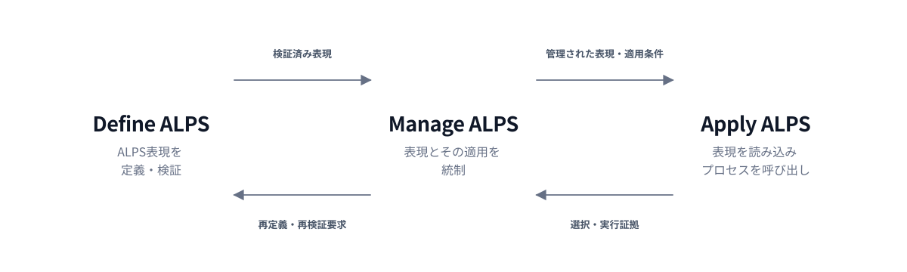

# ALPS — エージェントライフサイクルプロセススキル

<p align="right">
  <a href="../../../README.md">英語</a> | <strong>日本語</strong>
</p>

<p align="center">
  
</p>

<p align="center">
  <strong>バージョン0.4.0</strong><br>
  初期開発版
</p>

ALPSはプロセスフレームワークをエージェントスキルに適用し、人とエージェントが同じ意味体系を用いて、再利用可能な作業を定義、選択、呼び出し、改善できるようにします。

プロセススキルは、特定の実行主体や実装方法を一つに固定せず、その目的、成果、作業内容、入力、出力および適用条件を明示します。

## クイックスタート

### 1. プラグインをインストールする

ALPSは[Agent Plugins](https://agent-plugins.org/) v1パッケージとして配布します。Node.js 18以降の環境で[`plugins` CLI](https://www.npmjs.com/package/plugins)を使用してインストールします。

```console
npx plugins add mashimashica/alps
```

インストール後は、対象エージェントクライアントがスキルを再読込みできるよう再起動してください。

### 2. 必要なものを選ぶ

| エージェントスキル | 表現種別 | 使用する状況 |
| --- | --- | --- |
| [`alps-reference-model`](../../../skills/alps-reference-model/references/locales/ja/SKILL.md) | プロセス参照モデル | ALPSの参照プロセスとその関係を、プロセスの選択、アセスメントまたは改善に用いる場合。 |
| [`define-alps`](../../../skills/define-alps/references/locales/ja/SKILL.md) | プロセス | ALPS表現を作成、再定義または検証する場合。 |
| [`apply-alps`](../../../skills/apply-alps/references/locales/ja/SKILL.md) | プロセス | 既存表現をプロセス選択、呼び出し、組み合わせまたは受け渡しに用いる場合。 |
| [`manage-alps`](../../../skills/manage-alps/references/locales/ja/SKILL.md) | プロセス | 表現を採用、テーラリング、アセスメント、変更、改善または廃止する場合。 |

多くの場合は、最初に`alps-reference-model`を用いて、適用する参照プロセスを選択します。

他のプラグインが提供するプロセスモデルやプロセスビューも同じように選択に利用できます。`apply-alps`は、選択したモデルまたはビューが参照するプロセスを解決します。

### 3. エージェントへ依頼する

```text
`alps-reference-model`を読み込み、この依頼に適用するALPSの参照プロセスを決めてください。

`define-alps`を使って、この横断的関心事を扱うALPSのプロセスビューを定義・検証してください。

`apply-alps`を使って、適用するモデルまたはビューを読み込み、必要なプロセスを解決して、すべての出力と入力の受け渡しを明示してください。

`manage-alps`を使って、これらの表現と実行記録をアセスメントし、統制された改善を提案してください。
```

## ALPSの仕組み

### プロセス知識

出発点はプロセス記述です。

- **プロセス**は、実行される作業です。
- **プロセス記述**は、その作業を説明します。
- 既定では、**エージェントスキル**は正本となるプロセス記述によってプロセスを表現します。

有用なプロセス記述を読めば、次の問いに答えられます。

| 日常語の問い | ALPSの用語 |
| --- | --- |
| この作業はなぜ存在するか？ | **目的** |
| どの状態を成功とみなすか？ | **成果** |
| 何が生み出されるか？ | **出力** |
| 何が変換されるか？ | **入力** |
| どの作業がプロセスに属するか？ | **活動とタスク** |
| 何が作業を方向付け、制限し、または支援するか？ | **統制事項、制約、実行支援要素** |
| いつ作業を開始でき、いつ完了とみなせるか？ | **開始兺準と完了兺準** |
| プロセスはどこに適用されるか？ | **境界と適用文脈** |
| 誰が実行するか？ | 一般プロセスは固定しません。 |
| どのように実装するか？ | 一般プロセス記述は規定しません。 |

[プロセスフレームワーク](../../../spec/process-framework.md)は、これらの概念と意味を定義します。プロセス記述には名称、目的および成果が必要です。活動とタスクは作業内容であり、実装手順ではありません。入力は出力へ変換される項目です。人、エージェント、ツールおよび実行環境は、入力ではなく資源または実行支援要素です。

### 表現種別

エージェントスキルは既定ではプロセスを表現します。他のプロセスフレームワーク構成概念を表現することもできます。

| 表現 | 役割 |
| --- | --- |
| プロセス | 目的と成果によって独立した作業を定義します。 |
| プロセスモデル | 関係するプロセスとその関係を構成します。 |
| プロセス参照モデル | プロセスを名称、目的、成果で定義し、明示的に関係付けます。 |
| プロセスビュー | 特定の関心事または目的について複数プロセスを横断して活動とタスクを構成し、その適用方法を説明します。 |

直接の呼び出し対象となるのは、プロセス表現だけです。プロセスモデル、プロセス参照モデル、プロセスビューは、選択または構成の文脈を提供します。

プロセス以外の表現では、`SKILL.md`のメタデータで種別を宣言します。

```yaml
metadata:
  alps.kind: process-view
```

明示的に利用できる種別は`process-model`、`process-reference-model`、`process-view`です。プロセスビューは出典プロセスの活動やタスクを参照でき、必要に応じてビュー内で活動やタスクを記述できます。参照した出典要素の来歴と追跡可能性を維持し、ビュー内の記述だけで出典プロセスそのものを変更することはありません。

### ALPS参照モデル

ALPS自身のライフサイクルは三つの参照プロセスで定義します。これらは固定段階ではなく、必要に応じて並行的、反復的または再帰的に適用できます。

<p align="center">
  
</p>

正本となるプロセス参照モデルは[`skills/alps-reference-model/SKILL.md`](../../../skills/alps-reference-model/SKILL.md)として収録します。そこに三つの参照プロセスの名称、目的、成果を保持します。

## ALPS表現を作成する

答えようとする問いに応じて、次の資産を使用します。

| ニーズ | 最初に使用する資産 | 役割 |
| --- | --- | --- |
| プロセスの概念と意味を理解する | [プロセスフレームワーク](../../../spec/process-framework.md) | プロセス構成概念の上位規範。 |
| エージェントスキルによる構成概念の表現と統制を理解する | [ALPS仕様](../../../spec/ALPS-SPEC.md) | ALPS表現、ライフサイクルおよび適合に関する規範要件。 |
| 表現を定義、再定義または検証する | [`define-alps`](../../../skills/define-alps/references/locales/ja/SKILL.md) | アセスメント可能で利用可能なALPS表現を確立する参照プロセス。 |
| プロセス記述を起草する | [`SKILL-template.md`](../../../skills/define-alps/references/locales/ja/SKILL-template.md) | 参考用の起草例。ALPSの要件を定義するものではありません。 |

## リポジトリでALPSを利用する

ALPSを継続利用するリポジトリでは、[AGENTS.md](https://agents.md/)へ次のような方針を記載できます。

```md
## ALPS

このリポジトリではALPSを使用します。

- ALPS参照モデルがプロセス選択やアセスメントに必要な場合は`alps-reference-model`を読み込みます。
- エージェントスキルは既定ではプロセスを表現します。`metadata.alps.kind`を用いて、`process-model`、`process-reference-model`、`process-view`の各表現を区別します。
- 選択した各表現の`SKILL.md`を最後まで読みます。
- ALPS表現の定義・検証には`define-alps`、プロセス解決・呼び出しには`apply-alps`、採用、テーラリング、アセスメント、変更、廃止には`manage-alps`を用います。
- プロセスビューで出典プロセスの要素を参照する場合は来歴と追跡可能性を維持し、ビュー内の記述と出典プロセスの変更を区別します。
- プロセスを組み合わせる場合は必要な出力と入力の受け渡しを明示します。
```

## 目的に合う資産を探す

| 目的 | 英語 | 日本語 |
| --- | --- | --- |
| プロセスの意味を理解する | [Process Framework](../../../spec/process-framework.md) | [プロセスフレームワーク](../../../spec/locales/ja/process-framework.md) |
| ALPSの規範要件を読む | [ALPS Specification](../../../spec/ALPS-SPEC.md) | [ALPS仕様](../../../spec/locales/ja/ALPS-SPEC.md) |
| プロセス記述を起草する | [`SKILL-template.md`](../../../skills/define-alps/references/SKILL-template.md) | [`SKILL-template.md`](../../../skills/define-alps/references/locales/ja/SKILL-template.md) |
| リポジトリへ貢献する | [CONTRIBUTING.md](../../../CONTRIBUTING.md)および[AGENTS.md](../../../AGENTS.md) | [CONTRIBUTING.md](CONTRIBUTING.md)および[AGENTS.md](AGENTS.md) |
| リリース履歴とバージョン方針を確認する | [CHANGELOG.md](../../../CHANGELOG.md)および[Versioning](../../versioning.md) | [CHANGELOG.md](../../../CHANGELOG.md)および[バージョン管理](versioning.md) |

## バージョンとライセンス

ALPSはリポジトリ全体を一つのリリース単位として版管理します。現在の版は**0.4.0**であり、初期開発段階にあります。正確なリリース内容はGitタグとコミットで特定します。

明示した第三者資料を除き、本リポジトリには[Apache License 2.0](../../../LICENSE)を適用します。[NOTICE](../../../NOTICE)も参照してください。
