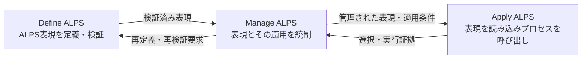

# ALPS — エージェントライフサイクルプロセススキル

<p align="right">
  <a href="../../../README.md">英語</a> | <strong>日本語</strong>
</p>

<p align="center">
  
</p>

<p align="center">
  <strong>バージョン0.3.0</strong><br>
  初期開発版
</p>

## ALPSとは

ALPSは、再利用可能なプロセス知識をエージェントスキルとして記述・利用するための共通言語です。

出発点はプロセス記述です。

- **プロセス**は、実行される作業です。
- **プロセス記述**は、その作業を説明します。
- 既定では、**エージェントスキル**は正本となるプロセス記述によってプロセスを表現します。

ALPSではさらに、エージェントスキルによって、**関係するプロセスを一つの構造にまとめるプロセスモデル**、**プロセスを名称、目的、成果で定義して関係を示すプロセス参照モデル**、**特定の関心事または目的について複数プロセスを横断して活動とタスクを構成し、その適用方法を説明するプロセスビュー**も表現できます。プロセスビューは既存プロセスの活動やタスクを参照でき、必要に応じてビュー内で活動やタスクを記述できます。出典要素を参照する場合は来歴と追跡可能性を維持し、ビュー内の記述だけで出典プロセスそのものを変更することはありません。これらをエージェントスキルで表現してもプロセスになるわけではありません。モデルやビューを読み込むことと、プロセスを呼び出して実行を開始することは区別します。

有用なプロセス記述を読めば、作業が存在する理由、成功とみなす状態、そのプロセスに属する作業、出入りするもの、および適用条件を理解できます。特定の実行主体や実装方法を一つに固定する必要はありません。

## ALPSを利用する

### プラグインをインストールする

ALPSは[Agent Plugins](https://agent-plugins.org/) v1パッケージとして配布します。Node.js 18以降の環境で次を実行します。

```console
npx plugins add mashimashica/alps
```

インストール後は、対象エージェントクライアントがスキルを再読込みできるよう再起動してください。

### ALPS参照モデルから始める

`alps-reference-model`はALPSのプロセス参照モデルを表現します。ALPSの参照プロセスを選択する場合や、その関係を確認する場合に読み込みます。モデルの読込み自体はプロセスの呼び出しではありません。

| エージェントスキル | ALPS表現 | 使用する状況 |
| --- | --- | --- |
| `alps-reference-model` | プロセス参照モデル | ALPSの参照プロセスとその関係を、プロセスの選択、アセスメントまたは改善に用いる場合。 |
| `define-alps` | プロセス | ALPS表現を作成、再定義または検証する場合。 |
| `apply-alps` | プロセス | 既存表現をプロセス選択、呼び出し、組み合わせまたは受け渡しに用いる場合。 |
| `manage-alps` | プロセス | 表現を採用、テーラリング、アセスメント、変更、改善または廃止する場合。 |

他のプラグインが提供するプロセスモデルやプロセスビューも同じように読み込めます。`apply-alps`は読み込んだモデルまたはビューからプロセスを解決し、プロセスを表現するエージェントスキルだけを呼び出します。

### 参照プロセスを明示的に利用する

```text
`alps-reference-model`を読み込み、この依頼に適用するALPSの参照プロセスを決めてください。

`define-alps`を使って、この横断的関心事を扱うALPSのプロセスビューを定義・検証してください。

`apply-alps`を使って、適用するモデルまたはビューを読み込み、必要なプロセスを解決して、すべての出力と入力の受け渡しを明示してください。

`manage-alps`を使って、これらの表現と実行記録をアセスメントし、統制された改善を提案してください。
```

### AGENTS.mdに利用方針を記載する

ALPSを継続利用するリポジトリでは、[AGENTS.md](https://agents.md/)へ次のような方針を記載できます。

```md
## ALPS

このリポジトリではALPSを使用します。

- ALPS参照モデルがプロセス選択やアセスメントに必要な場合は`alps-reference-model`を読み込みます。
- エージェントスキルは既定ではプロセスを表現します。`metadata.alps.kind`が`process-model`、`process-reference-model`または`process-view`を宣言する場合は、その表現を読み込み、その読込みをプロセスの呼び出しとして扱いません。
- 選択した各表現の`SKILL.md`を最後まで読みます。
- ALPS表現の定義・検証には`define-alps`、プロセス解決・呼び出しには`apply-alps`、採用、テーラリング、アセスメント、変更、廃止には`manage-alps`を用います。
- プロセスビューで出典プロセスの要素を参照する場合は来歴と追跡可能性を維持し、ビュー内の記述と出典プロセスの変更を区別します。
- プロセスを組み合わせる場合は必要な出力と入力の受け渡しを明示します。
```

## ALPS参照モデル

ALPS自身のライフサイクルは三つのプロセスで定義します。これらは固定段階ではなく、必要に応じて並行的、反復的または再帰的に適用できます。



正本となるプロセス参照モデルは[`skills/alps-reference-model/SKILL.md`](../../../skills/alps-reference-model/SKILL.md)として収録します。そこに三つの参照プロセスの名称、目的、成果を保持し、正本となる各プロセス記述との一致を機械的に検査できます。

## 表現種別

エージェントスキルは既定ではプロセスを表現します。プロセス以外の表現では、`SKILL.md`のメタデータで`kind`を宣言します。

```yaml
metadata:
  alps.kind: process-view
```

明示的に利用できる`kind`は次の三つです。

- `process-model`
- `process-reference-model`
- `process-view`

直接呼び出しの対象となるのはプロセスだけです。プロセスモデル、プロセス参照モデル、プロセスビューは、プロセスの構造、選択文脈、または横断的ビューを提供します。

## プロセススキルの読み方

ALPSは、一般的な記述で混同されやすい問いを区別します。

| 日常語の問い | ALPSの用語 |
|---|---|
| この作業はなぜ存在するか？ | **目的** |
| どの状態を成功とみなすか？ | **成果** |
| 何が生み出されるか？ | **出力** |
| 何が変換されるか？ | **入力** |
| どの作業がプロセスに属するか？ | **活動とタスク** |
| 何が作業を方向付け、制限し、または支援するか？ | **統制事項、制約、実行支援要素** |
| いつ作業を開始でき、いつ完了とみなせるか？ | **開始基準と完了基準** |
| プロセスはどこに適用されるか？ | **境界と適用文脈** |
| 誰が実行するか？ | 一般プロセスは固定しません。 |
| どのように実装するか？ | 一般プロセス記述は規定しません。 |

## プロセスフレームワーク

[プロセスフレームワーク](../../../spec/process-framework.md)は、ALPSが用いる再利用可能な語彙と意味を定義します。プロセス記述には、名称、目的および成果が必要です。活動とタスクは作業内容であり、実装手順ではありません。入力は出力へ変換される項目です。人、エージェント、ツールおよび実行環境は、入力ではなく資源または実行支援要素です。

フレームワークはプロセスモデル、プロセス参照モデル、プロセスビューも定義します。ALPSは、それらをエージェントスキルで表現する場合にも元の意味を保持します。

## 収録内容

| 内容 | 英語 | 日本語 |
| --- | --- | --- |
| プロセスフレームワーク | [process-framework.md](../../../spec/process-framework.md) | [process-framework.md](../../../spec/locales/ja/process-framework.md) |
| ALPS仕様 | [ALPS-SPEC.md](../../../spec/ALPS-SPEC.md) | [ALPS-SPEC.md](../../../spec/locales/ja/ALPS-SPEC.md) |
| `alps-reference-model` — プロセス参照モデル | [SKILL.md](../../../skills/alps-reference-model/SKILL.md) | [SKILL.md](../../../skills/alps-reference-model/references/locales/ja/SKILL.md) |
| `define-alps` — Define ALPSプロセス | [SKILL.md](../../../skills/define-alps/SKILL.md) | [SKILL.md](../../../skills/define-alps/references/locales/ja/SKILL.md) |
| `apply-alps` — Apply ALPSプロセス | [SKILL.md](../../../skills/apply-alps/SKILL.md) | [SKILL.md](../../../skills/apply-alps/references/locales/ja/SKILL.md) |
| `manage-alps` — Manage ALPSプロセス | [SKILL.md](../../../skills/manage-alps/SKILL.md) | [SKILL.md](../../../skills/manage-alps/references/locales/ja/SKILL.md) |

## 検証

[`alps-markdown/v1`](../../../spec/alps-markdown.md)という環境への対応付けは、本リポジトリが用いる範囲限定のMarkdown・フロントマター表現を定義します。そのプロファイル検査スクリプト`.agents/skills/review-alps/scripts/validate_alps_markdown.py`は、リポジトリ開発用`review-alps`プロセスの適用の実行支援要素です。このスクリプトは表現種別に応じて検査を振り分けます。プロセス参照モデルでは、参照プロセススキルを解決し、名称、目的、成果を正本となるプロセス記述と比較します。外部パッケージ参照は`--package-root`で明示的に対応付けできます。

機械的なプロファイル検査はレビューを支援しますが、それだけでALPSへの適合、成果達成またはプロセス実行適合を成立させるものではありません。

## バージョン管理

ALPSはリポジトリ全体を一つのリリース単位として版管理します。現在の版は**0.3.0**であり、初期開発段階にあります。正確なリリース内容はGitタグとコミットで特定します。[CHANGELOG.md](../../../CHANGELOG.md)および[バージョン管理](versioning.md)を参照してください。

## ライセンスと再利用

明示した第三者資料を除き、本リポジトリには[Apache License 2.0](../../../LICENSE)を適用します。[NOTICE](../../../NOTICE)も参照してください。
